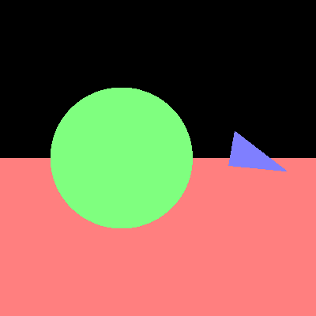

# COMP30019 - Project 1 - Ray Tracer

Majority of Stage 1 Camera and Fire ray at each pixel as well as Plane intersection  are generated base on the given knowledge on Workshop 3 with slight modification to suit the project context.

Triangle And Sphere Intersections are based on mathematicals found online as well as formated utilise external resources such as scratch pixel with heavy modification to suit the project context. Reference URL are visiable above each function.

Reflection and Refraction are based on external source Scrathpixel with modification to suit the project context
.Reference URL are also visable above the function.

Anti-Aliasing are ideas are inspired from "Ray tracing in one weekend" by Steve Hollasch with modification to match the project. Reference URL are also visable above the function.

Note that stage 2.6 are implement but are not entirely correct since it morphe the triangle objects. 
    (scene1_AA_X4.png and scene2_AA_X4 are included for easier reference when marking) 

Please ensure your student details are specified below (*exactly* as on UniMelb
records):

**Name:** Tuan Phong Vu \
**Student Number:** 1266265 \
**Username:** PhongDavidVu \
**Email:** tuanphongv@student.unimelb.edu.au

## Completed stages

Tick the stages bellow that you have completed so we know what to mark (by
editing README.md). **At most 9** marks can be chosen in total for stage
three. If you complete more than this many marks, pick your best one(s) to be
marked!

<!---
Tip: To tick, place an x between the square brackes [ ], like so: [x]
-->

##### Stage 1

- [x] Stage 1.1 - Familiarise yourself with the template
- [x] Stage 1.2 - Implement vector mathematics
- [x] Stage 1.3 - Fire a ray for each pixel
- [x] Stage 1.4 - Calculate ray-entity intersections
- [x] Stage 1.5 - Output primitives as solid colours

##### Stage 2

- [x] Stage 2.1 - Diffuse materials
- [x] Stage 2.2 - Shadow rays
- [x] Stage 2.3 - Reflective materials
- [x] Stage 2.4 - Refractive materials
- [x] Stage 2.5 - The Fresnel effect
- [x] Stage 2.6 - Anti-aliasing

##### Stage 3

- [ ] Option A - Emissive materials (+6)
- [ ] Option B - Ambient lighting/occlusion (+6)
- [ ] Option C - OBJ models (+6)
- [ ] Option D - Glossy materials (+3)
- [ ] Option E - Custom camera orientation (+3)
- [ ] Option F - Beer's law (+3)
- [ ] Option G - Depth of field (+3)

*Please summarise your approach(es) to stage 3 here.*

## Final scene render

Be sure to replace ```/images/final_scene.png``` with your final render so it
shows up here.


This render took 0 minutes and 2.083948 seconds on my PC.

I used the following command to render the image exactly as shown:

```
dotnet run -- -f tests/sample_scene_2.txt -o images/final_scene.png 
```

## Sample outputs

We have provided you with some sample tests located at ```/tests/*```. So you
have some point of comparison, here are the outputs our ray tracer solution
produces for given command line inputs (for the first two stages, left and right
respectively):

###### Sample 1

```
dotnet run -- -f tests/sample_scene_1.txt -o images/sample_scene_1.png -x 4
```

<p float="left">
  
   
</p>

###### Sample 2

```
dotnet run -- -f tests/sample_scene_2.txt -o images/sample_scene_2.png -x 4
```

<p float="left">
  
   
</p>

## References

https://www.scratchapixel.com/lessons/3d-basic-rendering/minimal-ray-tracer-rendering-simple-shapes/ray-sphere-intersection

https://www.scratchapixel.com/lessons/3d-basic-rendering/ray-tracing-rendering-a-triangle/ray-triangle-intersection-geometric-solution

https://raytracing.github.io/books/RayTracingInOneWeekend.html

https://www.scratchapixel.com/lessons/3d-basic-rendering/introduction-to-shading/reflection-refraction-fresnel

